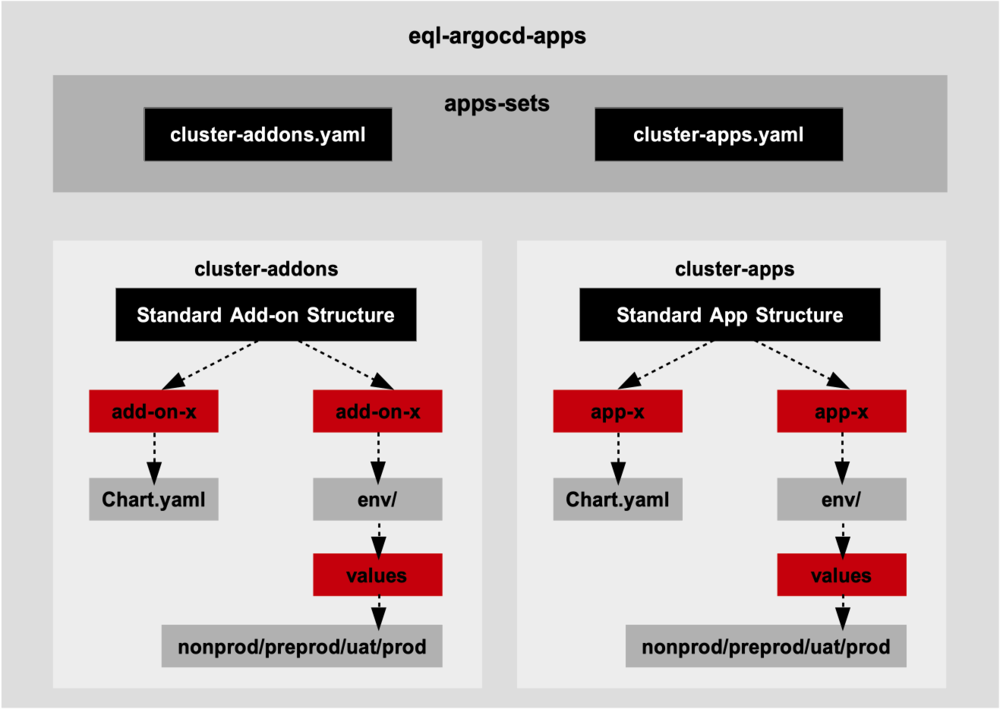
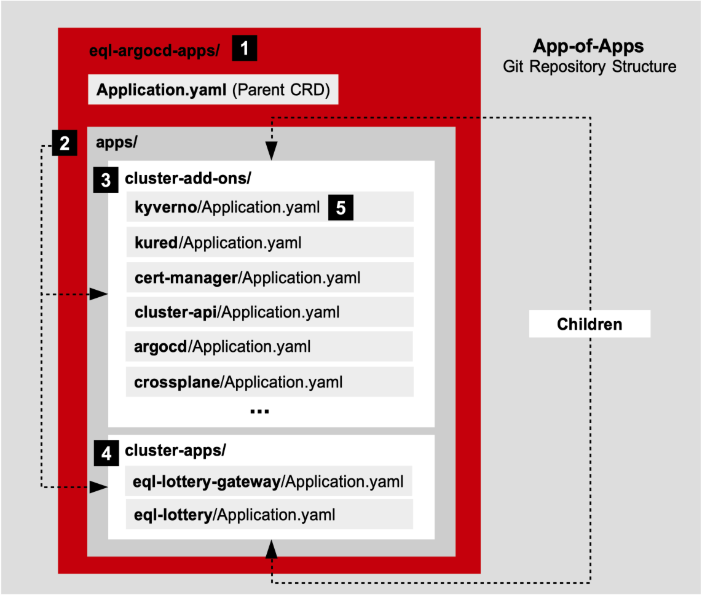

# ArgoCD ApplicationSets GitOps


## Architecture and Directory Structutre of ArgoCD ApplicationSets

This repository is a production-grade reference for running multi-cluster,
multi-environment GitOps on **ArgoCD ApplicationSets**, shown against a real
workload rather than a hello-world: a Rust full-stack drone-convoy tracking
system (Leptos/WASM frontend, GraphQL API, ScyllaDB + Redis) that exercises
operators, CRDs, Gateway API routing, secrets delivery and autoscaling — the
concerns a platform actually has.



The repository has three corners, and the whole argument depends on all three
being real:

```
apps/drone-convoy-tracker/                        the application (Rust + Containerfiles)
argocd-apps/cluster-apps/drone-convoy-tracker/    its Helm chart
argocd-apps/app-sets/templates/cluster-apps.yaml  the ApplicationSet that globs it up
```

```
argocd-apps/
├── app-sets/                    # ONE Helm chart producing the ApplicationSets
│   ├── values.yaml              # repo URL, cluster list, AppProjects, sync waves
│   └── templates/
│       ├── cluster-addons.yaml  # matrix (git dirs × cluster list), wave-grouped
│       └── cluster-apps.yaml    # matrix for workloads, wave 10
├── cluster-addons/              # one wrapper chart per platform addon
│   ├── argocd/                  #   (each: Chart.yaml pin + values.yaml base
│   ├── cert-manager/            #    + env/{nonprod,preprod,uat,prod}/ overlay
│   ├── crossplane/              #    + optional templates/ for CRs the addon
│   ├── external-dns/            #    needs: HTTPRoutes, Providers, Projects)
│   ├── external-secrets/
│   ├── goldilocks/  kargo/  keda/  kyverno/
│   ├── scylla-operator/  sealed-secrets/  vault/
│   └── ...
├── cluster-apps/                # one directory per workload chart
│   └── drone-convoy-tracker/    #   full chart + env/ overlays
└── cluster-secrets/             # ArgoCD cluster-registration Secrets (sealed)
```

The mechanics: `app-sets` is a single small Helm chart whose templates emit two
ApplicationSets. Each combines a **git directory generator** (globbing
`cluster-addons/*` or `cluster-apps/*`) with a **list generator** naming the
target clusters and their env overlay file, via a **matrix**. The cartesian
product — every chart directory × every environment — becomes the set of
generated Applications. Each Application renders its chart with
`values.yaml` + `env/<env>/values-<env>.yaml` (`ignoreMissingValueFiles: true`,
so overlays are optional), targeting that environment's cluster.

**Drop a chart directory into `cluster-apps/` and four Applications appear —
one per environment — with no per-app `Application.yaml` and no edit to any
shared file.** That is the demo.

Environment promotion is **by directory, not by branch**: promoting a change
to prod is a PR touching `env/prod/values-prod.yaml`, reviewable in one diff,
with no long-lived branches to reconcile. The hub-and-spoke topology options
(one ArgoCD control plane, per-cluster ArgoCD, and the hybrid) are diagrammed
in `docs/argocd-*-cp-cluster-*.png`; this repository implements the single
control-plane model, with spoke registration handled in `cluster-secrets/`
(see its README for the bootstrap ordering — ESO and sealed-secrets are
themselves addons, so the first secret cannot be delivered by a controller
that is not yet running).


## Advantages of ArgoCD ApplicationSets vs ArgoCD App-of-Apps



Three things App-of-Apps cannot do cleanly:

1. **No per-child `Application.yaml` to write or maintain.** App-of-Apps is a
   parent Application whose chart renders N child Application manifests — every
   new app or environment is another hand-written child, and cluster ×
   environment growth is multiplicative boilerplate. ApplicationSets generate
   the children from the repository's own shape: the directory IS the
   registration.
2. **Environment promotion by directory, not by branch.** With generated
   Applications, all four environments track one revision and differ only by
   values overlay. App-of-Apps deployments in practice drift toward
   branch-per-env or copy-paste child manifests, both of which rot.
3. **RBAC boundaries via AppProject, not everything in `default`.** Generated
   Applications land in `cluster-addons` or `cluster-apps` projects, each with
   its own `sourceRepos`, destinations and (for apps) an empty
   `clusterResourceWhitelist`. The ArgoCD RBAC in
   `cluster-addons/argocd/env/prod/values-prod.yaml` maps a platform group to
   addons and an app-team group to apps, defaulting everyone else to
   read-only. App-of-Apps *can* do projects, but the parent needs authority to
   create children across all of them, which concentrates exactly the
   privilege projects exist to separate.

**Blast radius — the first objection, answered before it is asked.** Deleting
an ApplicationSet deletes every Application it generated, and pruning follows.
This repository takes an asymmetric posture: `cluster-addons` carries
`applicationsSync: create-update`, `preserveResourcesOnDeletion: true` and the
resources finalizer — a fat-fingered ApplicationSet deletion does not tear the
platform out from under the workloads. `cluster-apps` keeps normal semantics,
so removing a chart directory removes the Application, which is what you want
for workloads. One dependency worth knowing: per-ApplicationSet
`applicationsSync` is honored only when the controller runs with
`--enable-policy-override` (set in `cluster-addons/argocd/values.yaml`);
without it the setting looks configured and silently does nothing.

**The ScyllaDB point.** Upstream ScyllaDB documentation states that Helm only
creates CRDs on first install and never updates them, and recommends their
GitOps manifest path over Helm for that reason. ArgoCD renders charts with
`--include-crds` and re-applies on every sync — so the ApplicationSet path
closes a gap the vendor documents as a Helm limitation. A vendor describing
the exact problem this delivery solves is the strongest paragraph in this
README.


## ArgoCD ApplicationSets w/ Cluster Addons

Addons are wrapper charts: a `Chart.yaml` pinning the upstream chart as a
dependency, a base `values.yaml`, thin env overlays, and — when the addon
needs cluster objects the upstream chart does not render — a `templates/`
directory of its own. Three worked examples of that last point live in this
repo: ArgoCD's AppProjects and its `HTTPRoute`, Goldilocks' `HTTPRoute`, and
Crossplane's `Provider` CRs (the current-generation install path; the old
values-level `provider.packages` named monolithic providers that have since
split into per-service families).

**Ordering is by sync wave, without losing the glob.** CRD providers must
reconcile before their consumers, so the ApplicationSet template groups
explicit directories into waves and a catch-all glob picks up everything else:

- **Wave -2** — cert-manager, external-secrets, sealed-secrets (CRDs and the
  secret-delivery path first)
- **Wave -1** — kyverno, crossplane, keda, scylla-operator
- **Wave 0 (catch-all)** — argocd, external-dns, goldilocks, kargo, vault, and
  any addon added later, with zero edits to shared files

The concrete case the mechanism exists for: **cert-manager (wave -2) must be
reconciled before scylla-operator (wave -1), because it issues the certificate
for the operator's webhook server.** Get that backwards and the operator
deployment sits Progressing forever with a webhook TLS error three layers
removed from the cause.

**The drop-in proof:** `external-dns` was added to this repository with no
edit to any shared file — its directory appeared, the catch-all globbed it,
four Applications generated. (It ships with `source: gateway-httproute` and
the DNS provider deliberately unset, since a reference must not choose your
DNS vendor.)

**Routing is Gateway API end to end.** Addon UIs (ArgoCD, Goldilocks) publish
`HTTPRoute`s parented to a shared platform Gateway; TLS terminates at the
Gateway listener with certificates issued by cert-manager
(`ExperimentalGatewayAPISupport` feature gate, enabled in the prod values).
There is no Ingress controller in this repository, and no values file
references one.

**The secrets story has one primary.** Vault is the backing store; External
Secrets Operator syncs Vault material into cluster Secrets; sealed-secrets is
kept **explicitly scoped to bootstrap-only** secrets that must exist before
ESO runs — concretely, the ArgoCD cluster-registration Secrets in
`cluster-secrets/` (full bootstrap ordering documented there). If a secret can
be delivered by ESO, it must be.

Chart pins are explicit versions, refreshed at delivery time. Before first
deployment, verify against the live indexes (`helm repo update && helm search
repo <chart> --versions`) — and read release notes for **Crossplane** and
**Kargo** specifically, both of which have had major transitions.


## ArgoCD ApplicationSets w/ Cluster Apps

`cluster-apps/drone-convoy-tracker/` is the workload proof: one chart
directory that the `cluster-apps` ApplicationSet turns into four Applications
(nonprod, preprod, uat, prod) at wave 10 — after every addon, because the
chart consumes what the addons provide.

The chart follows **screaming architecture**: a file's presence means that
concern is present.

```
cluster-apps/drone-convoy-tracker/templates/
├── app.yaml            # Deployments: GraphQL API + WASM frontend
├── app-service.yaml    # Cilium Gateway + HTTPRoute (UI and API, one hostname)
├── app-config.yaml     # application configuration
├── app-storage.yaml    # ScyllaCluster CR  -> needs scylla-operator (wave -1)
├── app-secrets.yaml    # ExternalSecret    -> needs ESO (wave -2)
│                       # + Certificate     -> needs cert-manager (wave -2)
├── app-scaling.yaml    # HPA + VPA recommender + KEDA ScaledObject
└── app-metrics.yaml    # ServiceMonitor
```

Every dependency arrow in that listing is a sync-wave justification: the app
chart instantiates CRs whose CRDs are owned by addons in earlier waves. The
`ScyllaCluster` CR is also the live demonstration of the CRD-lifecycle point
above — the operator (and its CRDs) are reconciled by ArgoCD on every sync,
not frozen at first install as Helm would leave them.

Serving is one hostname through the Cilium Gateway: the HTTPRoute sends UI
traffic to the frontend and `/graphql` (+ `/graphql/ws` for subscriptions) to
the API — which is also why the application uses same-origin API paths and
needs no CORS configuration.

Adding the next workload is the whole pitch restated: create
`cluster-apps/<name>/` with a chart and env overlays, commit, and four
Applications generate. No shared file changes, no per-app manifests, no ArgoCD
UI clicks.

---

### Appendix — VKS/VCF-specific configuration (skippable)

Nothing in the architecture above is VKS-specific. For deployment on VMware
Kubernetes Service under VCF 9.x, the deltas are confined to values overlays:
cluster API endpoints in `app-sets/values.yaml` point at Supervisor-provisioned
cluster URLs; the `cluster-secrets/` registration Secrets carry VKS kubeconfig
contexts; storage classes referenced by the ScyllaCluster CR map to vSAN
policies; and the shared Gateway's LoadBalancer is fulfilled by the VCF
networking stack (NSX/AVI) rather than a cloud provider. None of these change
a template — which is the point of keeping environment truth in overlays.
