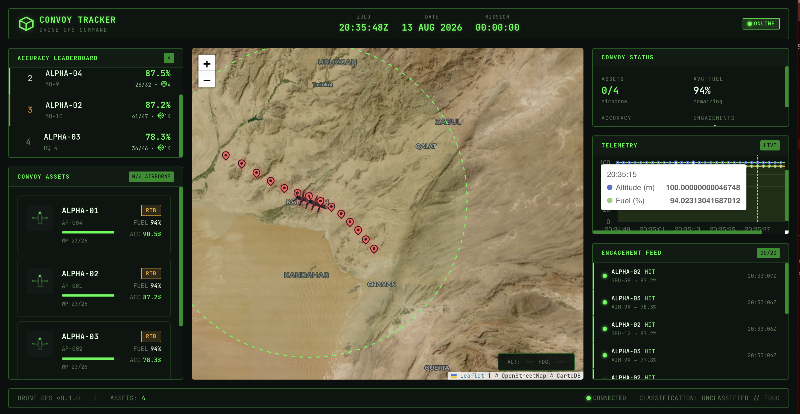
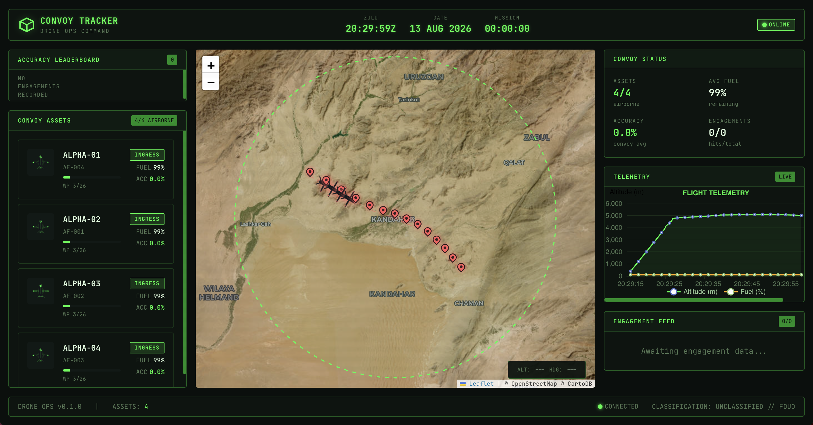
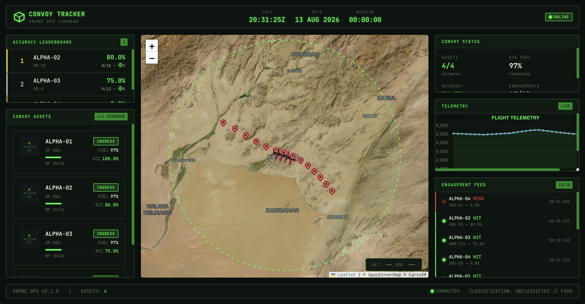
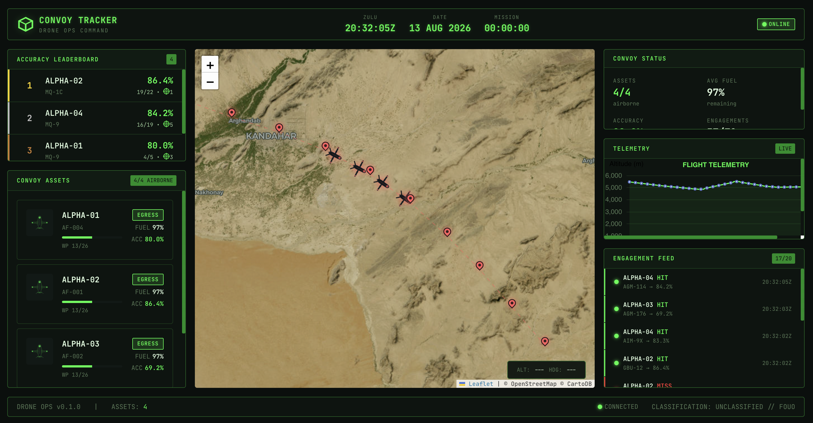
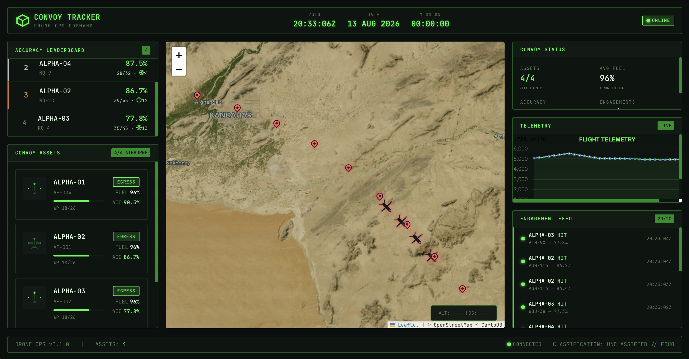

##  DoD Attack Drone Convoy Tracking System (Rust)

The provided Rust application is a full-stack DoD attack drone convoy tracking system using a WebAssembly native Rust Letpos frontend reading realtime WebSocket drone status telemetry, GraphQL drone leader tracking on the server-side using Redis RW cache cluster and ScyllaDB NoSQL DB (ScyllaDB is 100% rewrite of Cassandra DB NoSQL in C++).


See the following screenshots of systems frontend.

Screenshot 1


Screenshot 2


Screenshot 3


Screenshot 4 


Screenshot 5 



## Project Structure

```shell
drone-convoy-tracker
├── Cargo.lock
├── Cargo.toml
├── Makefile
├── README.md
├── assets
│   ├── fonts
│   └── images
│       ├── drone.svg
│       ├── explosion.svg
│       └── target-streak.svg
├── config
│   └── app.toml
├── containers
│   ├── Containerfile.api
│   ├── Containerfile.frontend
│   ├── nginx.conf
│   ├── podman-compose.dev.yml
│   ├── podman-compose.yml
│   └── prometheus.yml
├── crates
│   ├── drone-analytics
│   │   ├── Cargo.toml
│   │   └── src
│   │       ├── engine.rs
│   │       ├── error.rs
│   │       ├── lib.rs
│   │       ├── queries.rs
│   │       └── reports.rs
│   ├── drone-domain
│   │   ├── Cargo.toml
│   │   └── src
│   │       └── lib.rs
│   ├── drone-frontend
│   │   ├── Cargo.toml
│   │   ├── Trunk.toml
│   │   ├── assets
│   │   ├── index.html
│   │   ├── src
│   │   │   ├── components
│   │   │   │   ├── charts.rs
│   │   │   │   ├── drone_card.rs
│   │   │   │   ├── engagement_feed.rs
│   │   │   │   ├── footer.rs
│   │   │   │   ├── header.rs
│   │   │   │   ├── leaderboard.rs
│   │   │   │   ├── map.rs
│   │   │   │   └── mod.rs
│   │   │   ├── lib.rs
│   │   │   ├── main.rs
│   │   │   ├── services
│   │   │   │   ├── api.rs
│   │   │   │   ├── mod.rs
│   │   │   │   └── websocket.rs
│   │   │   └── state
│   │   │       └── mod.rs
│   │   └── style
│   │       └── main.css
│   ├── drone-graphql-api
│   │   ├── Cargo.toml
│   │   └── src
│   │       ├── config.rs
│   │       ├── context.rs
│   │       ├── error.rs
│   │       ├── lib.rs
│   │       ├── loaders
│   │       │   └── mod.rs
│   │       ├── main.rs
│   │       ├── resolvers
│   │       │   ├── mod.rs
│   │       │   ├── mutation.rs
│   │       │   ├── query.rs
│   │       │   └── subscription.rs
│   │       └── schema
│   │           ├── enums.rs
│   │           ├── inputs.rs
│   │           ├── mod.rs
│   │           └── objects.rs
│   ├── drone-persistence
│   │   ├── Cargo.toml
│   │   └── src
│   │       ├── cache
│   │       │   ├── mod.rs
│   │       │   └── redis_client.rs
│   │       ├── error.rs
│   │       ├── lib.rs
│   │       ├── repository
│   │       │   ├── mod.rs
│   │       │   └── scylla_impl.rs
│   │       └── strategy
│   │           ├── mod.rs
│   │           ├── read_strategy.rs
│   │           └── write_strategy.rs
│   └── drone-simulator
│       ├── Cargo.toml
│       └── src
│           ├── convoy.rs
│           ├── engagement.rs
│           ├── flight.rs
│           ├── lib.rs
│           ├── main.rs
│           └── telemetry.rs
├── deploy
├── docs
│   ├── Screenshot 2026-08-13 at 22.30.00.png
│   ├── Screenshot 2026-08-13 at 22.31.26.png
│   ├── Screenshot 2026-08-13 at 22.32.06.png
│   ├── Screenshot 2026-08-13 at 22.33.07.png
│   └── Screenshot 2026-08-13 at 22.35.49.png
└── schema
    └── cql
        ├── 000_keyspace_dev.cql
        ├── 000_keyspace_prod.cql
        ├── 001_core_schema.cql
        └── 002_waypoint_columns.cql
```


## The Architecture of the DoD Attack Drone Tracking Service

TODO: Discuss the full distributed systems architecture including all transports, the Redis cache and ScyllaDB schema design.


## Build Prerequisites 


## Building the Project


## References 

- Rust Leptos 
https://leptos.dev/

- ScyllaDB
https://www.scylladb.com/

- Rust Crates Registry
https://crates.io/

- Rust Site
https://rust-lang.org/


